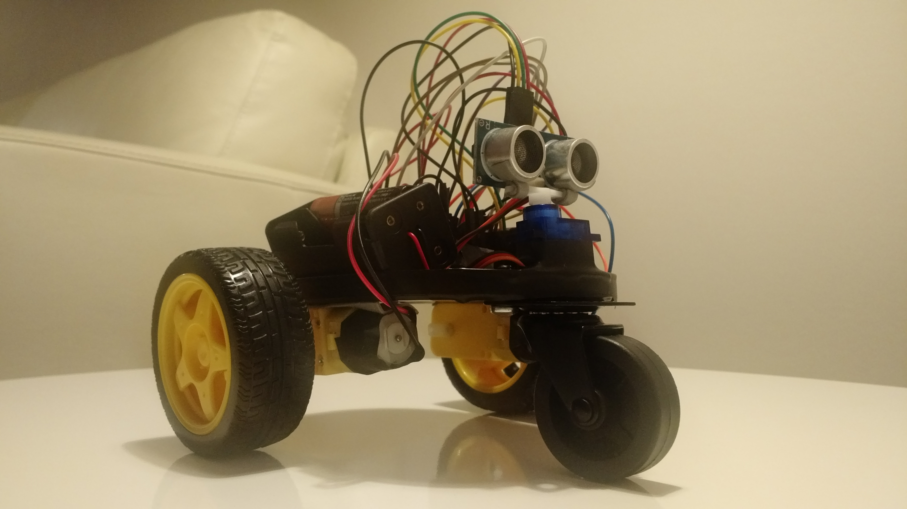

# arduino-robot-car
Self-driven robot car using Arduino board.

Here you can find the source code for Arduino UNO board ("roboCar.ino" file).
If you want to know how to build the robot's physical part, please visit the following site: https://iotchile.blogspot.com/2023/02/arduino-and-educational-robotics-self.html

-----

Auto-robot autónomo usando placa Arduino.

Aquí puedes encontrar el código fuente para ser aplicado sobre  la placa Arduino UNO (archivo "roboCar.ino").
Si quieres saber cómo construir la parte física del robot, visita el siguiente sitio: https://iotchile.blogspot.cl/2016/05/arduino-y-robotica-educativa-proyecto.html

# License
Copyright (c) 2016-2023 Milko Madariaga (mmadaria@gmail.com).
Licensed under the MIT license.
