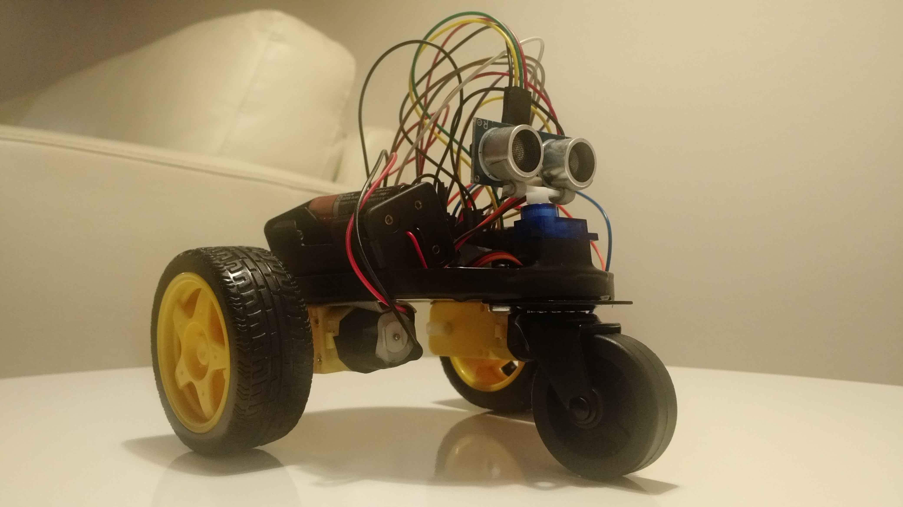

# arduino-robot-car
Self-driven robot car using Arduino board.

Here you can find the source code for Arduino UNO board ("roboCar.ino" file).
If you want to know how to build the robot's physical part, please visit one of the following sites:

- English version: https://iotchile.blogspot.com/2023/02/arduino-and-educational-robotics-auto.html
- Spanish version (información en español): https://iotchile.blogspot.cl/2016/05/arduino-y-robotica-educativa-proyecto.html

# License
Copyright (c) 2016 Milko Madariaga (mmadaria@gmail.com).
Licensed under the MIT license.
